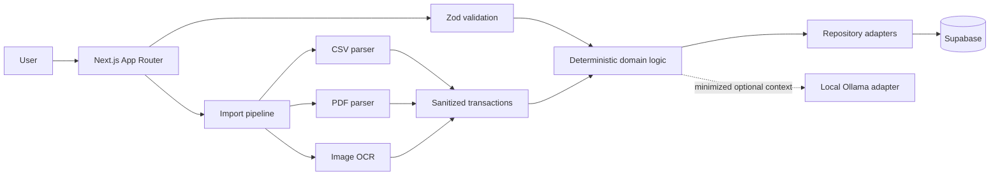

<div align="center">
  

  # Baki

  **AI-assisted subscription and personal cash-flow management for Malaysia**

  Track recurring commitments, import receipts and statements, evaluate subscription value, and forecast upcoming expenses—while keeping financial decisions deterministic and under user control.

  [](https://github.com/haziqariff703/baki/actions/workflows/ci.yml)
  [](https://nextjs.org/)
  [](https://www.typescriptlang.org/)
  [](https://supabase.com/)
  [](https://vitest.dev/)
</div>

> [!IMPORTANT]
> Baki provides explainable budgeting support, not regulated financial advice. It never executes payments, transfers money, accesses online-banking credentials, or automatically cancels subscriptions.

## Overview

Baki is a web-first application for university students and young working adults. It focuses on Malaysian Ringgit (MYR), supports English and Malay, and combines privacy-conscious document imports with deterministic financial rules.

Users remain in control: recurring-payment candidates must be confirmed before becoming subscriptions, and AI output can never override scoring rules or make irreversible decisions.

## Features

- **Subscription management** — track providers, billing cycles, renewal dates, categories, and status.
- **Receipt and statement imports** — process CSV, text-based PDF, scanned PDF, PNG, JPG, and WebP files up to 5 MB.
- **Malaysian receipt OCR** — Tesseract.js preprocessing and extraction for mobile banking receipts, including DuitNow QR payload support.
- **Bank statement parsing** — PDF.js/unpdf extraction with structured transaction parsing and page limits.
- **Recurring-payment detection** — group transactions and identify cadence candidates for explicit user review.
- **Deterministic value scoring** — calculate an explainable 0–100 score from five weighted criteria.
- **Cash-flow forecasting** — show monthly commitments, upcoming renewals, safe-to-spend estimates, and payday analysis.
- **Renewal notifications** — generate 7-day, 1-day, and day-of reminders.
- **Privacy controls** — manage consent, export personal data, and request verified account deletion.
- **Bilingual interface** — localized English (`en-MY`) and Malay (`ms-MY`) experiences with `next-intl`.
- **Row-level security** — enforce ownership at the PostgreSQL layer through Supabase RLS policies.

## How it works



The main dependency direction is:

```text
UI → application use cases → domain logic → repositories/adapters → Supabase or optional AI
```

Financial calculations remain pure TypeScript. External inputs are validated with Zod before reaching business logic or persistence.

## Deterministic scoring

Baki evaluates each subscription using five ratings from 1 to 5:

| Criterion | Weight |
| --- | ---: |
| Usage frequency | 25% |
| Necessity | 25% |
| Affordability | 20% |
| Uniqueness | 15% |
| Satisfaction | 15% |

The versioned `subscriptionScoreRuleV1` calculates each weighted contribution, assigns a score band, records the decision-tree path, and applies safeguards. Essential and affordable services cannot be naively pushed toward cancellation because of a low base score.

| Score | Outcome |
| ---: | --- |
| 75–100 | Keep |
| 55–74 | Review |
| 35–54 | Downgrade or pause |
| 0–34 | Consider cancelling |

## Import security and privacy

Uploaded financial documents are untrusted input. The import boundary applies:

- MIME type, extension, filename, and 5 MB size validation.
- Maximum CSV row and PDF page limits.
- Sanitization of extracted text and merchant names.
- Prompt-injection isolation: document text is treated only as data.
- Positive integer money values stored in sen, never floating-point currency.
- Immediate raw-file purging after successful extraction, subject to the configured retention policy.
- No sensitive document content, account numbers, tokens, or financial values in operational logs.

Use synthetic documents and identities in fixtures and development environments. Never commit real statements, receipts, credentials, or `.env` files.

## Technology

| Area | Stack |
| --- | --- |
| Application | Next.js 16 App Router, React 19, TypeScript strict mode |
| UI | Tailwind CSS, Radix UI, Lucide, GSAP, Framer Motion |
| Data | Supabase PostgreSQL, Auth, Storage, Row Level Security |
| Validation | Zod |
| Imports | Papa Parse, PDF.js, unpdf, Tesseract.js, jsQR |
| AI | Decoupled Ollama integration boundary (optional) |
| Localization | next-intl (`en-MY`, `ms-MY`) |
| Testing | Vitest unit, integration, security, and E2E-style suites |
| Deployment | Vercel and GitHub Actions |

## Getting started

### Prerequisites

- Node.js 22 LTS
- npm
- A Supabase project, or the Supabase CLI with Docker for local development
- Ollama only if you want optional local AI assistance

### Installation

```bash
git clone https://github.com/haziqariff703/baki.git
cd baki
npm install
```

Copy the environment template:

```bash
cp .env.example .env.local
```

On PowerShell:

```powershell
Copy-Item .env.example .env.local
```

Set these required values in `.env.local`:

```dotenv
NEXT_PUBLIC_SUPABASE_URL=https://your-project.supabase.co
NEXT_PUBLIC_SUPABASE_ANON_KEY=your-anon-key
```

Optional integrations and test credentials are documented in `.env.example`. Keep elevated Supabase keys server-side and never expose them through `NEXT_PUBLIC_*` variables.

### Local Supabase

To run the included migrations and synthetic seed data locally:

```bash
npx supabase start
npx supabase db reset
```

Use the URL and anonymous key printed by the Supabase CLI in `.env.local`.

### Run the application

```bash
npm run dev
```

Open [http://localhost:3000](http://localhost:3000). Locale-aware routes are available under `/en` and `/ms`.

## Available commands

| Command | Purpose |
| --- | --- |
| `npm run dev` | Start the development server |
| `npm run build` | Create a production build |
| `npm start` | Serve the production build |
| `npm run lint` | Run ESLint |
| `npm run typecheck` | Run TypeScript without emitting files |
| `npm test` | Run the Vitest suite once |
| `npm run test:watch` | Run Vitest in watch mode |

## Project structure

```text
baki/
├── app/                    # App Router pages and validated API handlers
├── components/             # Shared presentation components
├── features/               # Domain modules and deterministic business logic
│   ├── imports/            # CSV, PDF, OCR, sanitization, and storage pipeline
│   ├── recurring-detection/# Recurring candidate detection and confirmation
│   ├── scoring/            # Versioned score matrix and safeguards
│   ├── cash-flow/          # Forecasting and payday calculations
│   └── privacy/            # Data export and deletion workflows
├── lib/                    # Auth, validation, security, database, and adapters
├── messages/               # English and Malay translations
├── supabase/               # Migrations, policies, configuration, and seed data
├── tests/                  # Unit, integration, security, and E2E suites
└── docs/                   # Architecture, requirements, security, and ADRs
```

## Testing

Run the fast local checks:

```bash
npm run typecheck
npm run lint
npm test
```

Integration tests that exercise Supabase RLS require the dual-user test variables listed in `.env.example`. Fixtures must remain synthetic and must not contain real financial or personal information.

GitHub Actions runs lint, type checking, tests, and the production build for protected branches and pull requests.

## Documentation

- [System documentation](docs/README.md)
- [Architecture and database design](docs/architecture/system_design.md)
- [Business rules and scoring](docs/requirements/business_rules.md)
- [Functional and non-functional requirements](docs/requirements/functional_non_functional.md)
- [Security, privacy, and threat model](docs/security/threat_model_privacy.md)
- [Architecture decision records](docs/adr/decisions.md)
- [AI development constitution](AGENTS.md)

## Responsible development

Changes must preserve deterministic financial logic, runtime validation, user confirmation, explainability, least privilege, RLS ownership boundaries, and data minimization. Avoid unrelated refactors and accompany behavior changes with relevant tests.

This README was generated from the repository structure and documentation using the organizational style of [ReadmeAI](https://github.com/eli64s/readme-ai), then reviewed against Baki's implementation.
